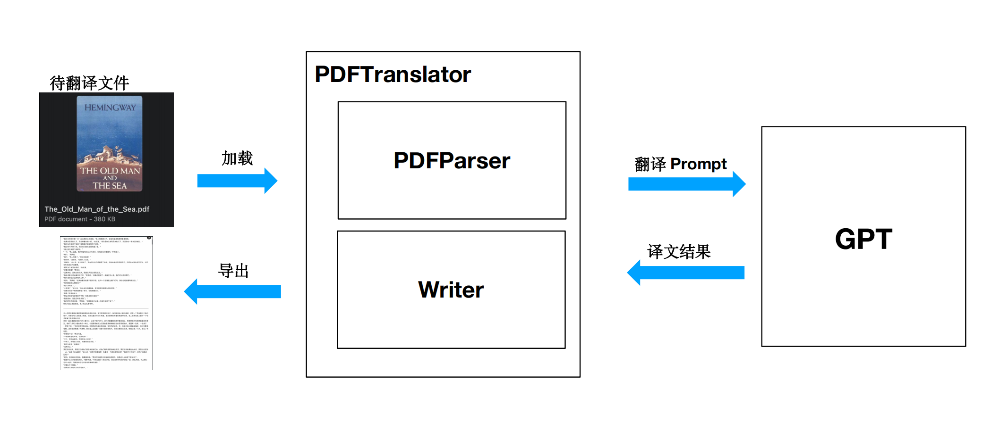
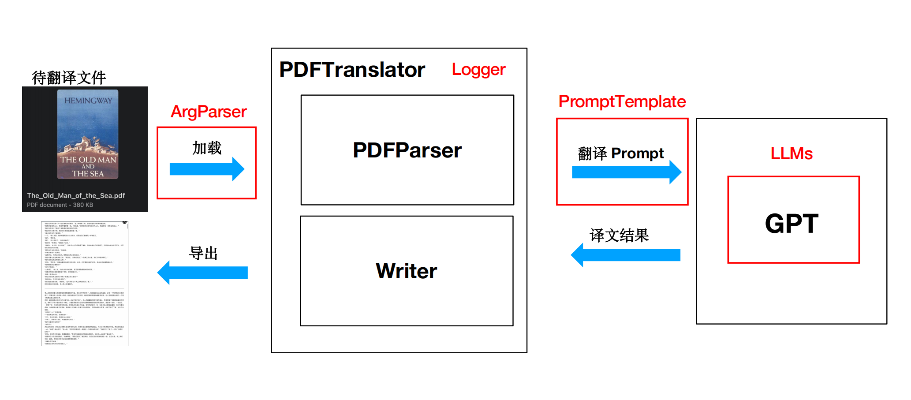
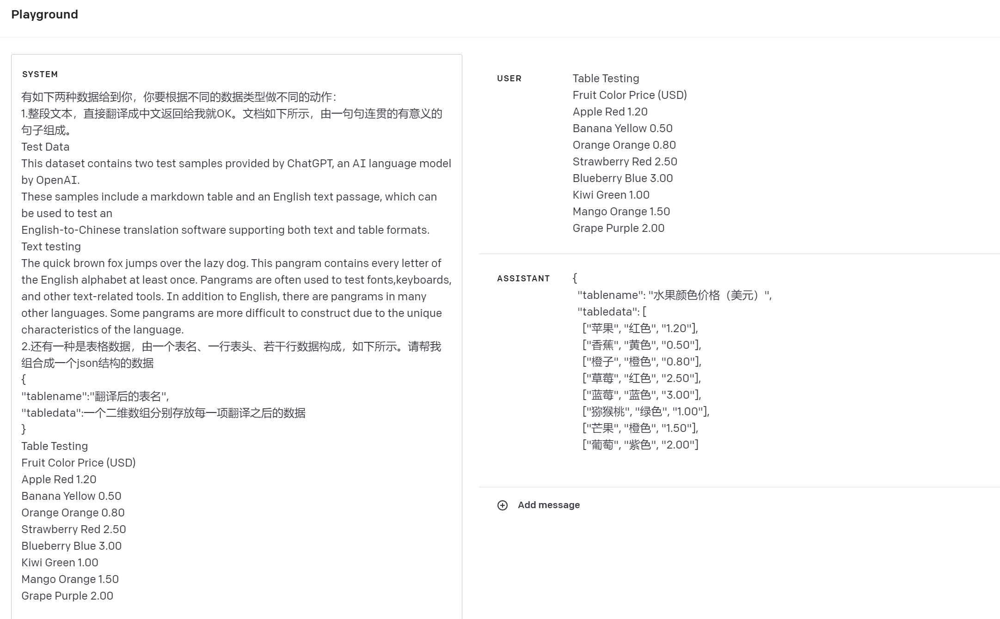

## 前言：

大家好，我是一个热衷于技术开发的极客，最近一段时间，我沉浸在极客时间的《AI 大模型应用开发实战营》课程中。这门课不仅系统地教我了大模型的运用技巧，而且启发了我尝试开发更多功能的OpenAI-Translator。我知道很多同学可能也在寻找这种实践的机会，所以，我决定分享我的开发历程和心得体会，希望对大家有所启发和帮助。如果你也和我一样对AI技术和开发充满热情，那么，这篇文章可能会为你提供一些有价值的参考。接下来，让我们一同深入探索我的学习和开发之旅。

## **OpenAI-Translator 项目介绍**

随着AI技术的飞速发展，机器翻译已经从一个遥不可及的梦想转变为我们每天都可以触手可及的工具。在极客时间的《AI 大模型应用开发实战营》课程的启发下，我决定推出一个新的翻译项目：OpenAI-Translator。以下是对其功能特点的详细介绍：

### **PDF 文件格式解析**

传统的文本翻译工具往往只支持纯文本格式。而OpenAI-Translator可以解析PDF文件，使您能够直接上传和翻译存储的知识和文档。

### **英文翻译成中文**

我们专注于为用户提供高质量的英文到中文翻译服务，助您轻松跨越语言障碍。

### **集成顶级AI模型**

OpenAI-Translator不仅支持OpenAI模型，还集成了ChatGLM模型，确保翻译的准确性和自然度。

### **灵活的配置方式**

为了适应不同的应用场景和用户习惯，我们支持通过YAML文件或命令行参数来灵活配置翻译工具的各种功能。

### **模块化和面向对象设计**

项目采用模块化和面向对象的设计方法，确保其具有良好的可扩展性和定制性。无论您是希望进行简单的修改还是希望添加全新的功能，都可以轻松实现。

### **总结**

OpenAI-Translator不仅仅是一个翻译工具，它是一个完全开放和可定制的翻译平台。无论您是一个日常用户，还是一个热衷于技术的开发者，都可以在这个项目中找到适合您的价值和应用场景。

------

> 希望这份介绍能为您提供一个清晰的项目概览，也期待您的加入和建议，一起推进OpenAI-Translator的发展！

## **OpenAI-Translator 项目未来发展规划**

在OpenAI-Translator项目的初步推出后，我们已经收到了大量的用户反馈和建议。我们深知，为了满足更多用户的需求，我们需要不断地完善和拓展项目的功能。以下是我们在近期计划中的开发项，这些功能尚未在当前版本中支持，但我们正积极开发中，并计划在后续版本中逐一实现：

**支持图形用户界面 (GUI)**

我们明白，为了进一步提升用户的使用体验，一个直观易用的图形界面是必不可少的。因此，我们计划推出一个简洁而功能强大的GUI，让用户可以更加方便地进行文件上传、翻译设置和结果预览。

### **保留PDF原始布局**

许多用户反馈希望在翻译后的PDF中保留原文的布局。我们已将此项列为高优先级，未来的版本中将支持保留PDF的原始布局，确保翻译后的文件格式与原文件保持一致。

### **服务化：API翻译服务支持**

为了满足企业和开发者的需求，我们计划推出OpenAI-Translator的API服务，用户可以直接集成到自己的应用或平台中，实现实时或批量的翻译需求。

### **支持更多的语言**

虽然当前版本主要针对英文到中文的翻译，但我们已经着手准备支持其他主要语言。未来，用户将能够体验到多语言之间的流畅翻译，包括但不限于日文、法文、德文等。

### **总结**

我们的愿景是打造一个全方位、高效准确的翻译工具，满足各类用户的需求。我们非常珍视每一位用户的反馈，也真诚地邀请各位持续关注我们的项目进展，并与我们共同推动OpenAI-Translator走向更远的未来。

------

> 感谢大家的支持与鼓励，我们承诺将不断努力，为大家带来更好的产品和服务体验！

## **OpenAI-Translator 项目技术架构和设计思路**

随着项目的深入发展，为了帮助大家更好地理解OpenAI-Translator的工作原理和设计思路，以下我将对其核心模块和工作流程进行详细介绍：

### **PDFParser 模块**

- **功能**：该模块负责加载PDF文档并解析其内容。
- **工作原理**：通过对PDF文件进行结构化解析，将其中的文本内容、格式和布局信息提取出来，并转化为可供后续处理的数据格式。

### **大语言模型管理模块**

- **功能**：该模块接收从PDFParser模块提取的文本内容，进行合适的组装，并生成用于翻译的prompt。
- **工作原理**：基于PDF中的文本内容，结合预设的翻译模板，动态生成与大语言模型兼容的翻译请求prompt。

### **大语言模型翻译**

- **功能**：负责对接收到的prompt进行翻译处理。
- **工作原理**：利用预训练的大模型如OpenAI或ChatGLM等，根据提供的prompt返回翻译后的文本。

### **Writer 模块**

- **功能**：根据翻译结果，生成目标文档。
- **工作原理**：将翻译后的文本内容、格式和布局信息重新组合并编码，生成与源PDF格式和布局相似的目标PDF文档。

### **整体工作流程**：

1. 用户上传PDF文档。
2. PDFParser模块加载文档，解析并提取文本内容。
3. 提取出的文本被送入大语言模型管理模块，进行prompt组装。
4. 组装后的prompt交由大语言模型进行翻译。
5. 翻译完成后的内容传递给Writer模块。
6. Writer模块基于翻译内容生成新的PDF文档并提供给用户下载。

### **总结**：

通过这种模块化的设计思路，OpenAI-Translator能够确保每一步操作都是独立且高效的，同时也为未来的功能拓展和优化提供了良好的基础。

------

> 希望通过这份技术架构和设计思路的介绍，大家能够更加清晰地了解OpenAI-Translator的内部机制。如有任何建议或问题，欢迎与我们交流，共同推进项目的完善和发展！

## **OpenAI-Translator 项目技术架构与优化方案**

在持续深入的项目开发与思考中，我认识到初始架构在实际实施过程中可能存在一些局限性，为此我对OpenAI-Translator的架构进行了一次优化，以更好地满足实际需求和潜在的拓展。以下将详细展示优化后的各个模块功能与特点：

### **PDF 文档解析（PDFParser）模块**

- **功能**：负责加载与解析PDF文档，提取文本内容与布局信息。
- **特点**：支持多种PDF版本，确保文本的准确抽取与格式的忠实还原。

### **文档导出（Writer）模块**

- **功能**：根据翻译结果，生成格式化的目标文档。
- **特点**：高度还原源文档布局，提供多种输出格式选项。

### **大模型（LLMs）接入模块**

- **功能**：负责与预训练大模型如OpenAI、ChatGLM等的交互与数据传递。
- **特点**：支持模型的动态切换，确保翻译效果与实时性。

### **参数解析器（ArgParser）模块**

- **功能**：接受并解析程序启动时的入参，提供灵活的程序配置方式。
- **特点**：支持多种参数输入方式，易于集成与调用。

### **日志（Logger）模块**

- **功能**：记录程序运行过程中的关键事件、操作和可能的错误。
- **特点**：支持多级别日志记录，易于问题定位与系统监控。

### **提示词（Prompt）模块**

- **功能**：生成与优化翻译prompt，确保翻译的准确性与自然性。
- **特点**：根据文档内容与上下文动态生成提示词，增强翻译的针对性。

### **总体工作流程**：

1. 用户通过**参数解析器**设置启动参数。
2. **PDFParser**模块加载用户文档，进行内容与布局的解析。
3. **Prompt**模块根据提取的文本内容，生成翻译请求的提示词。
4. 提示词交由**LLMs**模块进行翻译处理。
5. **Writer**模块接收翻译结果，生成翻译后的文档。
6. 整个过程中，**Logger**模块负责记录关键操作与事件，以便后续的分析与优化。

### **结论**： 

这种模块化与优化的设计不仅使OpenAI-Translator更具健壮性，同时也为未来功能的迭代与扩展提供了坚实的基础。期待与更多同行交流与合作，共同推进这一项目的发展与完善。

------

> 感谢您的关注，任何建议与反馈都是我们前进的动力。让我们携手，为OpenAI-Translator续写更多精彩篇章！

## **深入了解 OpenAI-Translator: PDF 文档解析（PDFParser）模块**

当我们提到PDF文件的翻译和处理，其中一个核心的、不可或缺的部分就是PDF的解析。OpenAI-Translator中，我们特别重视这一环节，并采用了一款强大的开源工具——pdfplumber来支撑我们的`PDFParser`模块。下面，我们将详细探讨此模块的工作原理、特点以及为什么选择基于pdfplumber进行开发。

### 1. **什么是 pdfplumber？**

pdfplumber是一个Python库，提供了一系列工具来提取PDF文档中的信息。不同于其他简单的文本提取工具，pdfplumber能够处理PDF中的表格、图形以及其他复杂布局元素，确保信息的完整和准确性。

### 2. **PDFParser 的工作原理**

- **加载文档**：首先，通过pdfplumber的接口，我们加载用户上传的PDF文件。
- **文本提取**：利用pdfplumber，我们可以按页进行文本内容的抽取，同时保留其原始的格式与布局信息。
- **特殊元素处理**：对于表格、图形或其他特殊格式，pdfplumber提供了专门的方法进行识别和解析，确保这些信息也被完整地提取出来。

### 3. **为什么选择 pdfplumber？**

- **高度的准确性**：pdfplumber基于PDF的内部结构进行内容的解析，能够更准确地提取各种元素。
- **强大的功能**：除了基本的文本抽取，pdfplumber还支持诸如表格识别、图形解析等高级功能，满足了我们对PDF处理的复杂需求。
- **良好的社区支持**：作为一个活跃的开源项目，pdfplumber有一个庞大的用户和开发者社区，常规的更新和维护保证了其稳定性和持续的功能刷新。

### 4. **PDFParser 的特色**

- **模块化设计**：结合pdfplumber，我们将PDF解析分为多个子功能，如文本抽取、表格识别等，方便未来的拓展和优化。
- **灵活的配置**：用户可以根据自己的需求，选择解析的内容范围或优化参数，实现更加精细化的内容提取。
- **高效的性能**：通过对pdfplumber进行适当的封装和优化，我们确保PDFParser模块在大型或复杂的PDF文件上都能保持流畅的性能。

------

> 总的来说，PDFParser模块是OpenAI-Translator项目的核心之一，它确保了我们从PDF中获得的数据既完整又准确。感谢pdfplumber这样的优秀开源工具，为我们提供了强大的技术支持。

## **深入了解 OpenAI-Translator: 提示词（Prompt）模块**

在使用大型语言模型（如OpenAI的GPT系列模型）进行任务执行时，选择合适的提示词（prompt）是至关重要的。正确、精确的prompt能够指导模型更好地理解和执行特定的任务。在OpenAI-Translator项目中，我们为此设计了一个专门的`Prompt`模块，旨在针对不同的数据类型和特征，为模型提供更有针对性的指引。接下来，让我们详细了解该模块的设计和功能。

### 1. **提示词的重要性**

提示词或prompt是我们提供给模型的指示或问题，它告诉模型我们想要的输出类型和格式。选择恰当的prompt对于获得高质量、有针对性的结果至关重要。

### 2. **系统角色设定**

为了确保模型能够明确理解和执行我们的指令，我们在Prompt模块中采用了“系统角色”的概念。通过设定不同的系统角色，我们可以告诉模型特定数据类型的特征，如：

- 文本角色：处理普通的文本数据，诸如段落、句子等。
- 表格角色：专门针对表格数据，识别表头、行列数据等。

### 3. **不同数据的处理方式**

每种数据类型可能需要不同的处理策略：

- **文本数据**：直接进入翻译流程，确保句意、语境的准确性。
- **表格数据**：首先识别表头和数据区，然后逐列、逐行进行翻译。特别的，表格中的数据可能需要格式转换、单位匹配等额外处理。

### 4. **Prompt模块的工作流程**

1. **数据识别**：首先确定输入数据的类型，是文本、表格或其他类型。
2. **角色分配**：根据数据类型，为模型分配相应的“系统角色”，以便模型能够更好地理解和处理数据。
3. **生成提示词**：结合系统角色和任务需求，生成具体的prompt，引导模型进行任务执行。
4. **接收模型输出**：获取模型的响应，并进行后处理，如格式化、修饰等，最终产生期望的输出结果。

------

> Prompt模块不仅保证了模型输出的准确性和质量，还为用户提供了灵活的配置和定制选项。通过不断的优化和迭代，我们希望此模块能为OpenAI-Translator带来更高效、更智能的翻译体验。

------

## **结束语**

回顾整个OpenAI-Translator的设计和实现过程，我们可以看到在现代的AI技术背景下，如何将一个概念转化为一个实用的工具。感谢您的耐心阅读和关注。如果您对这个项目感兴趣或者有任何建议和想法，欢迎访问[项目地址](https://github.com/DjangoPeng/openai-quickstart.git)来查看详细代码、提交问题或参与贡献。每一位用户的反馈都是对我们的鼓励和动力。在未来，我们希望OpenAI-Translator能够持续成长，为更多用户带来高效、准确的翻译服务。再次感谢您的支持，期待与您的下一次交流！

------

## **特别鸣谢**

在项目的开发和完善过程中，我想特别感谢**极客时间的《AI 大模型应用开发实战营》**课程。这个课程不仅为我提供了深入浅出的理论知识，更为我在实践中遇到的问题提供了有效的指导和解决方案。

课程中的许多实例和案例，都为我的项目开发提供了巨大的帮助。感谢极客时间和所有授课老师的辛勤付出，让我能够更加深入地理解和掌握AI大模型的应用技巧。

任何成功的项目背后，都有一个团队的辛勤工作和支持。在这里，我想表示我对极客时间的衷心感谢，感谢你们为这个社区带来如此宝贵的资源！